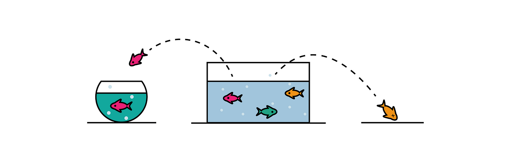

# Previsão de Churn com classificação

Um banco requisitou um modelo de machine learning para a identificação de clientes em churn, buscando encontrar o maior número de clientes possível para direcionar melhores estratégias.

Como cientista de dados, é necessário entregar, no final do projeto, uma lista com os 20 clientes mais prioritários.

Os dados foram obtidos no [Kaggle](https://www.kaggle.com/datasets/mervetorkan/churndataset).  

## Versões do projeto:

### 1. CRISP 1: foi separado em sprints, seguindo a ideia trabalhada na abordagem SCRUM. Foi buscado dar um resultado mínimo de projeto no menor tempo possível.

* Objetivos da Sprint 1

    - Descrição dos dados
    - Análise geral dos dados
    - Planejamento e substituições de NA
    - Lista de hipóteses
    - Split do dataset

* Objetivos da Sprint 2
    - EDA
    - Data preparation

* Objetivos da Sprint 3

    - Implementação dos algoritmos de Machine learning
    - Métricas de performance
    - Avaliação final

* Objetivos da Sprint 4

    - Foi feito um [deploy](https://huggingface.co/spaces/deborabmfreitas/churn-prediction-deploy) do modelo para a experimentação inicial.

### 2. **CRISP 2**: projeto final (mais atualizado).

O projeto foi comentado abaixo.

# Pontos importantes do projeto

- **Algoritmos de Machine lerning utilizados**
    - DummyClassifier
    - LogisticRegression
    - **SVC** (modelo selecionado ✅)
    - KNeighborsClassifier
    - DecisionTreeClassifier
    - RandomForestClassifier
    - LGBMClassifier

- **Métricas e avaliações presentes**
    - Acurácia
    - Recall (métrica priorizada ✅)
    - Precisão
    - F1-score
    - AUC + curva ROC
    - Matriz de confusão
    - Curva de ganho
    - Curva lift

# Visão geral

Após o entendimento do negócio, o **recall** foi utilizado como métrica para treinar os modelos, pois nesse caso, **é mais importante detectar todos os possíveis clientes que serão churn do que fazer classificações precisas**. O fato de os dados serem desbalanceados também indica que a métrica de acurácia seria enviesada.

Pelo fato de estarem desbalanceados, inicialmente foram utilizadas diferentes técnicas de balanceamento, como o SMOTE (oversampling) e NearMiss (undersampling), no entanto, não trouxeram melhorias. Por esse motivo, no treinamento dos algoritmos foi acrescentado o argumento `class_weight`, que determina pesos de acordo com a proporção de instâncias para as classes. A classe que representa o churn '1' recebeu o maior peso.

Além disso, foram utilizados transformadores customizados para a preparação dos dados e todo o workflow do projeto foi automatizado com **pipelines**, com cuidados para evitar data leakage.

Após a escolha do melhor modelo, que no projeto foi o SVC por apresentar a melhor performance de recall e AUC, foi feita a otimização dos hiperparâmetros utilizando o módulo `RandomizedSearchCV`.

# Descrição dos dados

Coluna | Descrição
-------|----------
RowNumber | Nº da linha
CustomerId | ID do cliente
Surname | Sobrenome do cliente
CreditScore | Pontuação de crédito do cliente para o mercado de consumo
Geography | País onde o cliente reside
Gender | Gênero do cliente
Age | Idade do cliente
Tenure| Nº de meses que o cliente permaneceu ativo
Balance  | Valor gasto pelo cliente
NumOfProducts | Nº de produtos comprados pelo cliente
HasCrCard | Indica se o cliente possui ou não um cartão de crédito
IsActiveMember | Indica se o cliente ainda tem o cadastro ativo na empresa
EstimatedSalary | Estimativa de salário mensal do cliente
Exited | Indica se o cliente está ou não em churn 

# Performance do modelo

Modelo | Accuracy | Recall | Precision | AUC |
-------|----------|--------| ----------| ---- |
SVC | 0.71	| **0.84** | 0.40 | 0.85

# Lista prioritária de clientes em churn

Através do modelo, foi possível prever os clientes que mais tinham chance de churn. Abaixo é possível ver uma representação da lista com os mais propensos. Para visualizar a lista completa, acesso notebook do [projeto]().

CustomerId| Surname | Gender | Age | churn_score |
-------|----------|--------| ----------| ---- |
15656822 | Day	| Male | 43 | 0.97
15719508 | Davis	| Male | 49 | 0.95
15647898| Russell	| Female | 50 | 0.94
15622033| Rapuluchukwu	| Female| 41 | 0.88
15605279 | Francis | Male | 50 | 0.87
15589017 | Chiu	| Male | 55 | 0.859
15781272| Coles	| Male | 50 | 0.854
15759436| Aksenov | Female	| 50 | 0.849
15793307 | Calabresi | Female	| 0.40 | 0.846
15806808 | Hope	| Female | 41 | 0.841

